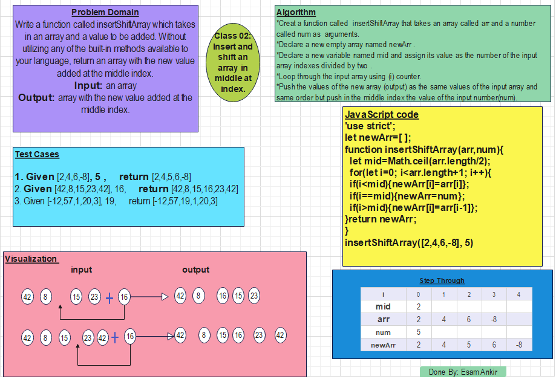

# Insert and shift an array in middle at index
Write a function called insertShiftArray which takes in an array and a value to be added. Without utilizing any of the built-in methods available to your language, return an array with the new value added at the middle index.

## Whiteboard Process



## Approach

*Creat a function called  insertShiftArray that takes an array called arr and a number called num as  arguments.
*Declare a new empty array named newArr .
*Declare a new variable named mid and assign its value as the number of the input array indexes divided by two .
*Loop through the input array using (i) counter.
*Push the values of the new array (output) as the same values of the input array and same order but push in the middle index the value of the input number(num).


## JavaScript Code

```js
'use strict';
let newArr=[];
function insertShiftArray(arr,num){
  let mid=Math.ceil(arr.length/2);
  for(let i=0; i<arr.length+1; i++){
  if(i<mid){newArr[i]=arr[i]};
  if(i==mid){newArr=num};
  if(i>mid){newArr[i]=arr[i-1]};
}return newArr;
};
insertShiftArray([2,4,6,-8], 5)
```


