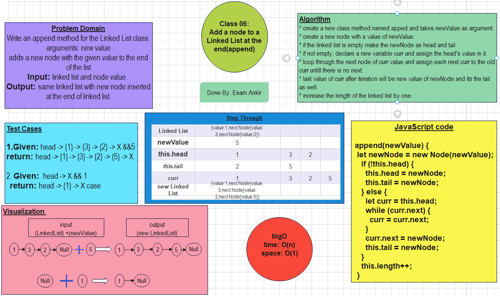

# Implementation: Singly Linked Lists

## screenshots

## Specifications

* Read all of these instructions carefully.
* Name things exactly as described.
* Do all your work in a your data-structures-and-algorithms public repository.
* Create a new branch in your repo named as noted below.
* Follow the language-specific instructions for the challenge type listed below.
* Update the “Table of Contents” - in the README at the root of the repository - with a link to this challenge’s README file.

## Challenge Setup & Execution

**Branch Name: linked-list-insertions**

**Challenge Type: Extending an Implementation**

## Features

Write the following methods for the Linked List class:

**append**

arguments: new value

adds a new node with the given value to the end of the list

**insert before**

arguments: value, new value

adds a new node with the given new value immediately before the first node that has the value specified

**insert after**

arguments: value, new value

adds a new node with the given new value immediately after the first node that has the value specified

## Testing

Write tests to prove the following functionality:

1. Can successfully add a node to the end of the linked list
2. Can successfully add multiple nodes to the end of a linked list
3. Can successfully insert a node before a node located i the middle of a linked list
4. Can successfully insert a node before the first node of a linked list
5. Can successfully insert after a node in the middle of the linked list
6. Can successfully insert a node after the last node of the linked list

