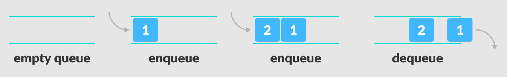

# Queue Data Structure

## Features

Using a Linked List as the underlying data storage mechanism, implement both a Queue.

### Node

Create a Node class that has properties for the value stored in the Node, and a pointer to the next node.

### Queue

Create a Queue class that has a front property. It creates an empty Queue when instantiated.

This object should be aware of a default empty value assigned to front when the queue is created.

The class should contain the following methods:

***enqueue***

Arguments: value

adds a new node with that value to the back of the queue with an O(1) Time performance.

***dequeue***

Arguments: none

Returns: the value from node from the front of the queue

Removes the node from the front of the queue

Should raise exception when called on empty queue

***peek***

Arguments: none

Returns: Value of the node located at the front of the queue

Should raise exception when called on empty stack

***is empty***

Arguments: none

Returns: Boolean indicating whether or not the queue is empty

You have access to the Node class and all the properties on the Linked List class.

## Testing

Write tests to prove the following functionality:

Can successfully enqueue into a queue
Can successfully enqueue multiple values into a queue
Can successfully dequeue out of a queue the expected value
Can successfully peek into a queue, seeing the expected value
Can successfully empty a queue after multiple dequeues
Can successfully instantiate an empty queue
Calling dequeue or peek on empty queue raises exception
