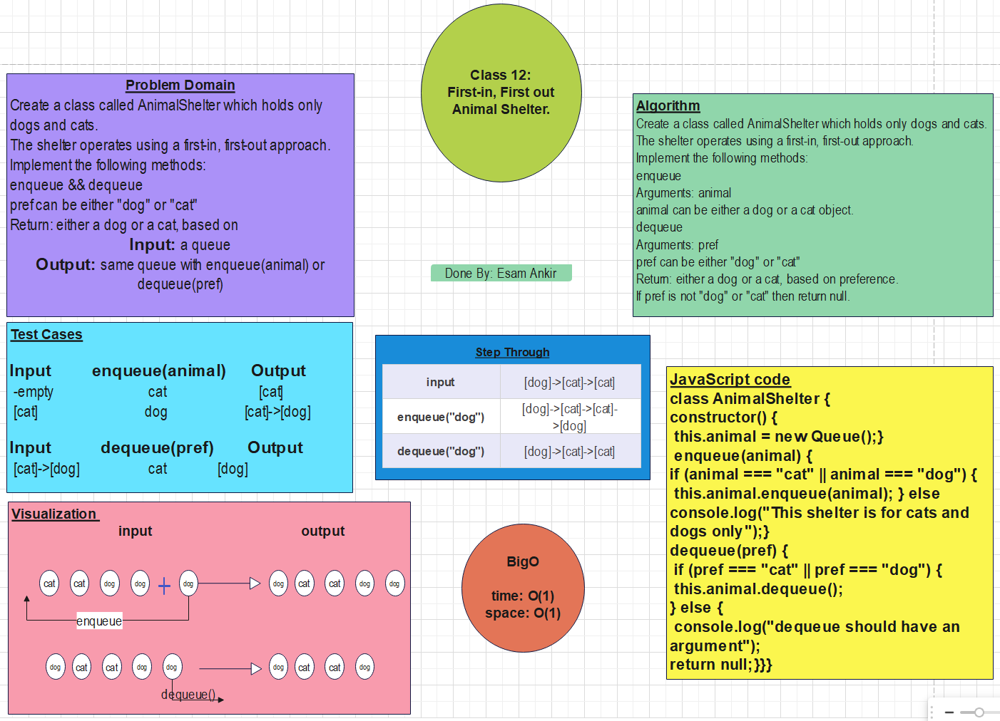

# Queue Data Structure

## Features

Create a class called AnimalShelter which holds only dogs and cats.

The shelter operates using a first-in, first-out approach.

Implement the following methods:

***enqueue***

- Arguments: animal

- animal can be either a dog or a cat object.

***dequeue***

- Arguments: pref

- pref can be either "dog" or "cat"

- Return: either a dog or a cat, based on preference.

- If pref is not "dog" or "cat" then return null.

## Testing

Write tests to prove the following functionality:

Can successfully enqueue into a queue

Can successfully enqueue multiple values into a queue

Can successfully dequeue out of a queue the expected value

Can successfully empty a queue after multiple dequeues

Can successfully instantiate an empty queue

Calling dequeue or peek on empty queue raises exception
