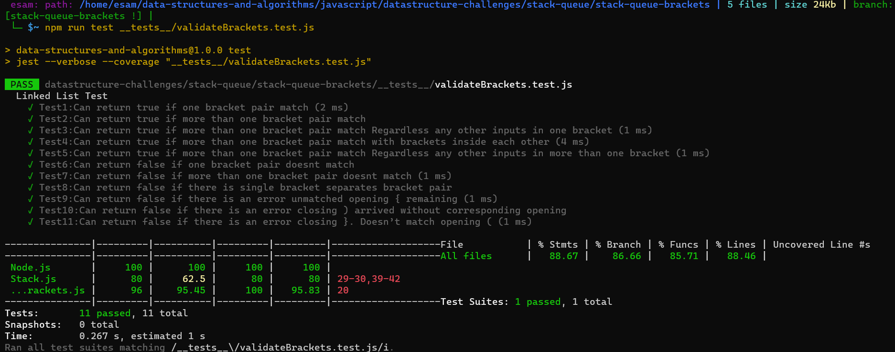

# Multi-bracket Validation.

## Specifications

Read all of these instructions carefully.

Name things exactly as described.

Do all your work in a your data-structures-and-algorithms public repository.

Create a new branch in your repo named as noted below.

Follow the language-specific instructions for the challenge type listed below.

Update the “Table of Contents” - in the README at the root of the repository - with a link to this challenge’s README file.

Challenge Setup & Execution

Branch Name: stack-queue-brackets

Challenge Type: Code Challenge / Algorithm

## Feature Tasks

Write a function called validate brackets

Arguments: string

Return: boolean

representing whether or not the brackets in the string are balanced

- There are 3 types of brackets:

Round Brackets : ()

Square Brackets : []

Curly Brackets : {}

Example

Input	Output

{}	TRUE

{}(){}	TRUE

()[[Extra Characters]]	TRUE

(){}[[]]	TRUE

{}{Code}[Fellows](())	TRUE

[({}]	FALSE

(](	FALSE

{(})	FALSE

Consider these small examples and why they fail.

Input	Output	Why

{	FALSE	error unmatched opening { remaining.

)	FALSE	error closing ) arrived without corresponding opening.

[}	FALSE	error closing }. Doesn’t match opening (.

