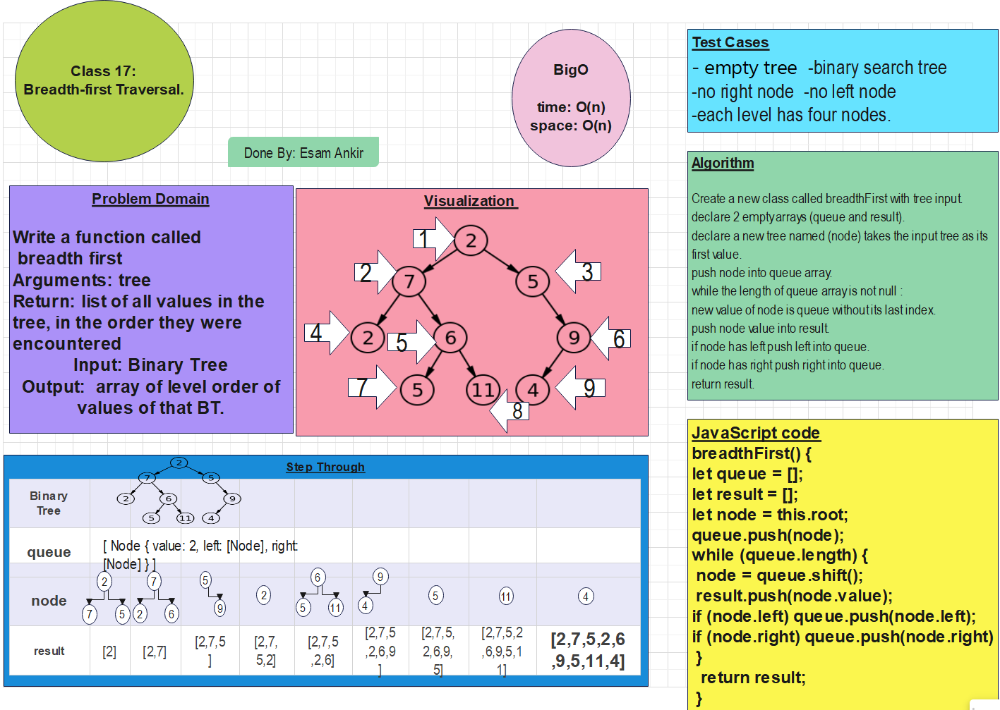
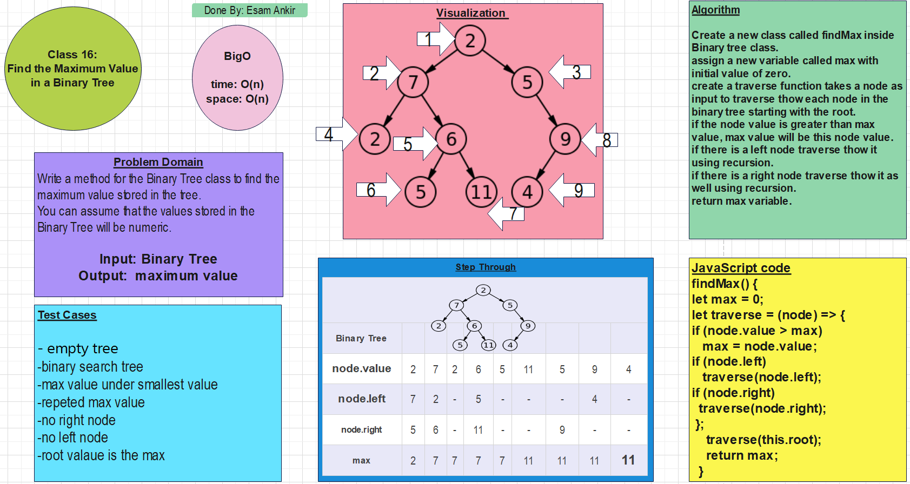
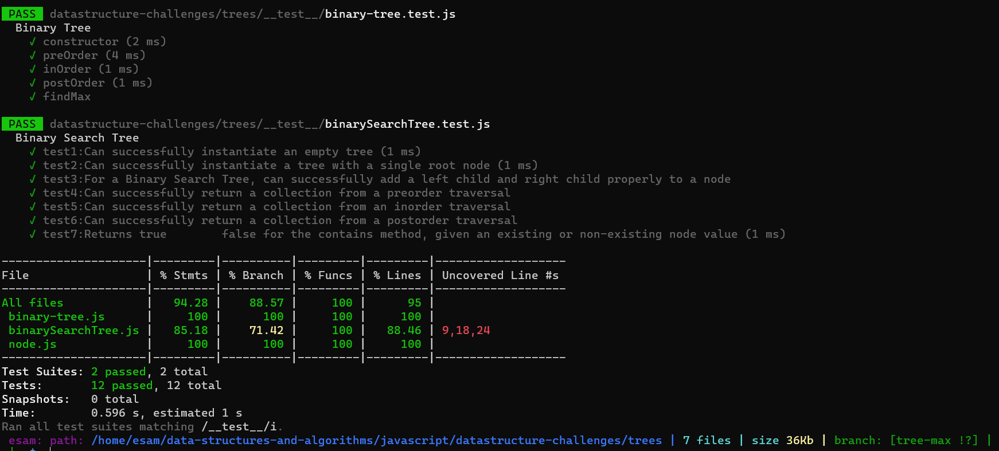

# Trees

## Whiteboard for breadthFirst

## Whiteboard for findMax

## Tests screenshot

## Features

***Node***

Create a Node class that has properties for the value stored in the node, the left child node, and
the right child node.

### Binary Tree

Create a Binary Tree class

Define a method for each of the depth first traversals:

***pre order***

***in order***

***post order*** which returns an array of the values, ordered appropriately.

### Binary Search Tree

Create a Binary Search Tree class

This class should be a sub-class (or your languages equivalent) of the Binary Tree Class, with the
following additional methods:

***Add***

Arguments: value

Return: nothing

Adds a new node with that value in the correct location in the binary search tree.

***Contains***

Argument: value

Returns: boolean indicating whether or not the value is in the tree at least once.

## Structure and Testing

Write tests to prove the following functionality:

- Can successfully instantiate an empty tree

- Can successfully instantiate a tree with a single root node

- For a Binary Search Tree, can successfully add a left child and right child properly to a node

- Can successfully return a collection from a preorder traversal

- Can successfully return a collection from an inorder traversal

- Can successfully return a collection from a postorder traversal

- Returns true	false for the contains method, given an existing or non-existing node value

