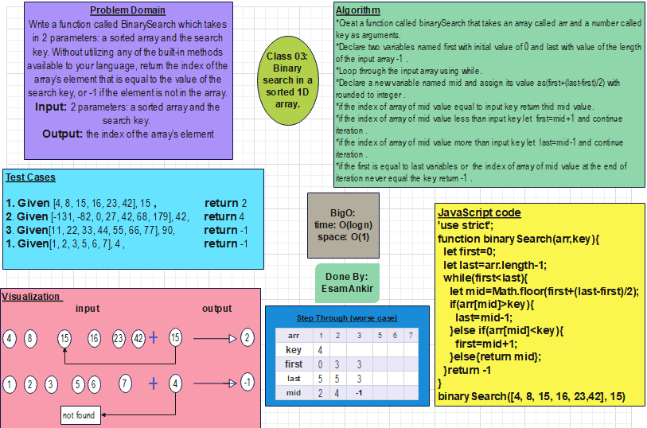

# Binary search in a sorted 1D array.

## Domain
Write a function called BinarySearch which takes in 2 parameters: a sorted array and the search key. Without utilizing any of the built-in methods available to your language, return the index of the array’s element that is equal to the value of the search key, or -1 if the element is not in the array.


## Whiteboard Process



## Approach

Algorithm
* Creat a function called binarySearch that takes an array called arr and a number called key as arguments.
* Declare two variables named first with initial value of 0 and last with value of the length of the input array -1 .
* Loop through the input array using while.
*Declare a new variable named mid and assign its value as(first+(last-first)/2) with rounded to integer .
* if the index of array of mid value equal to input key return thid mid value.
*if the index of array of mid value less than input key let  first=mid+1 and continue iteration .
* if the index of array of mid value more than input key let  last=mid-1 and continue iteration .
*if the first is equal to last variables or  the index of array of mid value at the end of iteration never equal the key return -1 .


## JavaScript Code

```js
function binarySearch(arr,key){
  let first=0;
  let last=arr.length-1;
  while(first<=last){
    let mid=Math.floor(first+(last-first)/2);
    if(arr[mid]>key){
      last=mid-1;
    }else if(arr[mid]<key){
      first=mid+1;
    }else{return mid};
  }return -1
}
console.log((binarySearch([4, 8, 15, 16, 23,42], 15)))
console.log((binarySearch([1, 2, 3, 5, 6, 7], 4)))
```


