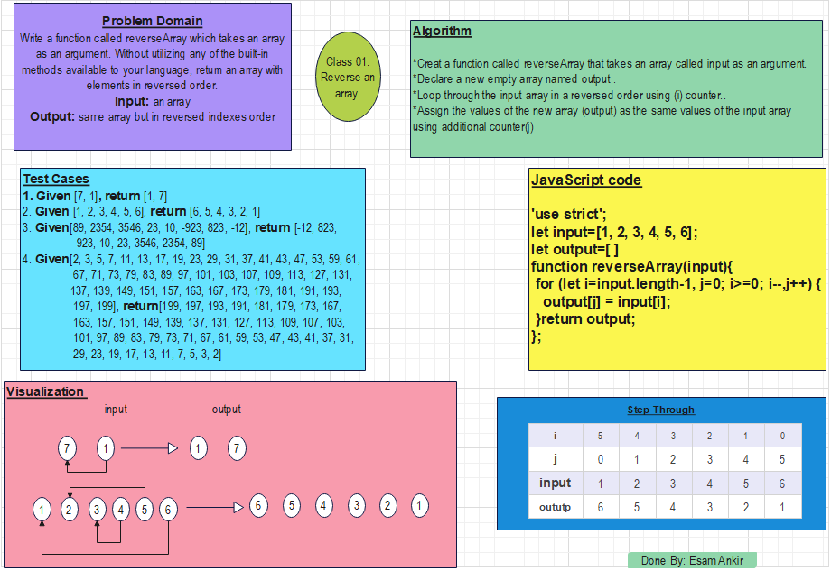

# Reverse an Array
Write a function called reverseArray which takes an array as an argument. Without utilizing any of the built-in methods available to your language, return an array with elements in reversed order.

## Whiteboard Process



## Approach

*Creat a function called reverseArray that takes an array called input as an argument.
*Declare a new empty array named output .
*Loop through the input array in a reversed order using (i) counter..
*Assign the values of the new array (output) as the same values of the input array using additional counter(j)


## JavaScript Code

```js
'use strict';
let input=[1, 2, 3, 4, 5, 6];
let output=[ ]
function reverseArray(input){
 for (let i=input.length-1, j=0; i>=0; i--,j++) {
   output[j] = input[i];
 }return output;
};
```


